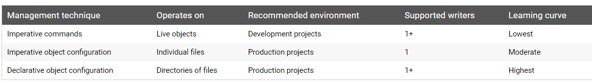

# Kubernetes

[TOC]

## 1 概述

### 1.1 Kubernetes是什么？


用于管理容器化的工作负载与服务，可促进声明式配置和自动化。

+ 传统部署时代：物理机+APP，资源分配问题，scale-out问题。

+ 虚拟化部署时代：物理机+Hypervisor+VM+APP，每个VM是一台完整的计算机，在虚拟化硬件之上运行所有组件，包括其自己的操作系统。
+ 容器部署时代：物理机+Container Runtime+容器+APP，容器之间共享操作系统，但拥有自己的文件系统、CPU、内存、进程空间等。由于它们与基础架构分离，因此可以跨云和OS分发进行移植。

注意：镜像不可变性，只能回滚。

***

容器是打包和运行应用程序的好方式。

Kubernetes为你提供：

+ 服务发现与负载均衡：Kubernetes可以使用DNS名称或自己的IP地址公开容器，如果到容器的流量很大，Kubernetes可以负载均衡并分配网络流量，从而使部署稳定。
+ 存储编排：Kubernetes允许你自动挂载你选择的存储系统，例如本地存储、公有云提供商等。
+ 自动部署和回滚：你可以使用Kubernetes描述已部署容器的所需状态，它可以以受控的速率将实际状态更改为所需状态。例如，你可以自动化Kubernetes来为你的部署创建新容器，删除现有容器并将它们的资源用于新容器。
+ 自动二进制打包：Kubernetes允许你指定每个容器所需CPU和内存（RAM）。当容器指定了资源请求时，Kubernetes可以做出更好的决策来管理容器的资源。
+ 自我修复：Kubernetes重新启动失败的容器、替换容器、杀死不响应用户定义的运行状况检查的容器，并且在准备好服务之前不将其通告给客户端。
+ 密钥与配置管理：Kubernetes允许你存储和管理敏感信息，例如密码、OAuth令牌和ssh密钥。你可以在不重建容器镜像的情况下部署和更新密钥和应用程序配置，也无需在堆栈配置中暴露密钥。

编排的技术定义是执行已定义的工作流程：首先执行A，然后执行B，再执行C。相比之下，Kubernetes包含一组独立的、可组合的控制过程，这些过程连续地将当前状态驱动到所提供的所需状态。（终态）

### 1.2 Kubernetes组件

一个Kubernetes集群包括由一组被称作节点的机器组成。这些节点上运行Kubernetes所管理的容器化应用。集群具有至少一个工作节点和至少一个主节点。

工作节点托管作为应用程序组件的Pod，主节点管理集群中的工作节点和Pod。多个主节点用于为集群提供故障转移和高可用性。


***

控制平面组件

+ kube-apiserver：主节点上负责提供Kubernetes API服务的组件；它是Kubernetes控制面的前端。
+ etcd：兼具一致性和高可用性的键值数据库，可以作为保存Kubernetes所有集群数据的后台数据库。
+ kube-scheduler：监视那些新创建的未指定运行节点的Pod，并选择节点让Pod在上面运行。
+ kube-controller-manager：在同一个进程中运行
  + 节点控制器（Node Controller）：负责在节点出现故障时进行通知和响应。
  + 副本控制器（Replication Controller）：负责为系统中的每个副本控制器对象维护正确数量的Pod。
  + 端点控制器（Endpoints Controller）：填充端点（Endpoints）对象（即加入Service与Pod）。
  + 服务账户和令牌控制器（Service Account & Token Controllers）：为新的命名空间创建默认账户和API访问令牌。
+ cloud-controller-manager：运行与基础云提供商交互的控制器。云供应商专有的代码由云供应商自己维护，并与运行Kubernetes的云控制器管理器相关联。以下控制器具有云提供商依赖性：
  + 节点控制器（Node Controller）：用于检查云提供商以确定节点是否在云中停止响应后被删除。
  + 路由控制器（Route Controller）：用于在底层云基础架构中设置路由。
  + 服务控制器（Service Controller）：用于创建、更新和删除云提供商负载均衡器。
  + 数据卷控制器（Volume Controller）：用于创建、附加和装载卷、并与云提供商进行交互以编排卷。

***

Node组件

维护运行的Pod并提供Kubernetes运行环境。

+ kublet：一个在集群中每个节点上运行的代理。它保证容器都运行在Pod中。
+ kube-proxy：网络代理，实现Kubernetes Service概念的一部分。维护节点上的网络规则，这些网络规则允许从集群内部或外部的网络会话与Pod进行网络通信。
+ container runtime：负责运行容器的软件，如Docker、containerd、cri-o，rktlet。

***

插件（Addons）

插件使用Kubernetes资源（DaemonSet，Deployment等）实现集群功能。因为这些提供集群级别的功能，所以插件的命名空间资源属于`kube-system`命名空间。

+ DNS：为Kubernetes服务提供DNS记录。
+ Dashboard（用户界面）：Web前端。
+ 容器资源监控：将关于容器的一些常见的时间序列度量值保存到一个集中的数据库中，并提供用于浏览这些数据的界面。
+ 集群层面日志：将容器的日志数据保存到一个集中的日志存储中，该存储能够提供搜索和浏览接口。


### 1.3 Kubernetes API

API版本

为了使删除字段或重构资源表示更加容易，Kubernetes支持多个API版本。每一个版本都在不同API路径下，例如`/api/v1`或者`/apis/extensions/v1beta1`。

+ Alpha测试版：
  + 版本名称包含了`alpha`（例如：`v1alpha1`）。
  + 可能是有缺陷的。启用该功能可能会带来隐含的问题，默认情况是关闭的。
  + 支持的功能可能在没有通知的情况下随时删除。
  + API的更改可能会带来兼容性问题，但是在后续的软件发布中不会有任何通知。
  + 由于bugs风险的增加和缺乏长期的支持，推荐在短暂的集群测试中使用。
+ Beta测试版：
  + 版本名称包含了`beta`（例如：`v2beta3`）。
  + 代码已经测试过。启用该功能被认为是安全的，功能默认已启用。
  + 所有已支持的功能不会被删除，细节可能会发生变化。
  + 对象的模式和/或语义可能会在后续的beta测试版或稳定版中以不兼容的方式进行更改。发生这种情况时，我们将提供迁移到下一个版本的说明。这可能需要删除、编辑和重新创建API对象。执行编辑操作时需要谨慎行事，这可能需要停用依赖该功能的应用程序。
  + 建议仅用于非业务关键型用途，因为后续版本中可能存在不兼容的更改。如果你有多个可以独立升级的集群，则可以放宽此限制。
  + 请尝试我们的beta版本功能并且给出反馈！一旦它们退出beta测试版，我们可能不会做出更多的改变。
+ 稳定版本：
  + 版本名称是`vX`，其中`X`是整数。
  + 功能的稳定版本将出现在许多后续版本的发行软件中。

***

API组

为了更容易的扩展Kubernetes API，我们实现了API组。API组在REST路径和序列化对象的apiVersion字段中指定。

目前有几个API组正在使用中：

1. 核心组（通常被称为遗留组）位于REST路径`/api/v1`并使用`apiVersion: v1`。
2. 指定的组位于REST路径`/apis/$GROUP_NAME/$VERSION`，并使用`apiVersion: $GROUP_NAME/$VERSION`（例如：`apiVersion: batch/v1`）。

### 1.4 使用Kubernetes对象

#### 1.4.1 理解Kubernetes对象

Kubernetes对象是持久化的实体。Kubernetes使用这些实体去表示整个集群的状态。特别的，它们描述了如下信息：

+ 哪些容器化应用在运行（以及在哪个Node上）
+ 可以被应用使用的资源
+ 关于应用运行时表现的策略，比如重启策略、升级策略、以及容错策略。

Kubernetes对象是“目标性记录”，包含两个嵌套的对象字段spec和status。分别描述对象的期望状态（Desired State）、以及对象的实际状态（Actual State)。在任何时刻，Kubernetes控制面一直努力地管理着对象的实际状态以与期望状态相匹配。

***

描述Kubernetes对象

当使用Kubernetes API创建对象时，API请求必须在请求体中包含JSON格式的信息。大多数情况下，使用.yaml文件提供这些信息。

必需字段：

+ `apiVersion`：创建该对象所使用的Kubernetes API的版本。
+ `kind`：想要创建的对象的类型。
+ `metadata`：帮助识别对象唯一性的数据，包括一个`name`字符串、UID和可选的`namespace`。
+ `spec`：终态。

### 1.4.2 Kubernetes对象管理



警告：应该只使用一种技术来管理Kubernetes对象。混合和匹配技术作用在同一对象上将导致未定义行为。

***

命令式命令

> ```sh
> kubectl run nginx --image nginx
> ```

***

命令式对象配置

> ```sh
> kubectl create -f nginx.yaml
> ```

***

声明式对象配置

> ```sh
> kubectl diff -f configs/
> kubectl apply -f configs/
> ```

### 1.4.3 对象名称和IDs

集群中的每一个对象都有一个名称来标识在同类资源中的唯一性。（例如：只能有一个Pod叫`myapp-1234`，但是可以有一个Deployment也叫`myapp-1234`。）

每一个Kubernetes对象也有一个UID来标识在整个集群中的唯一性。（UUID）